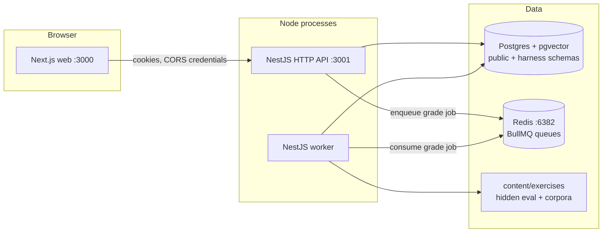
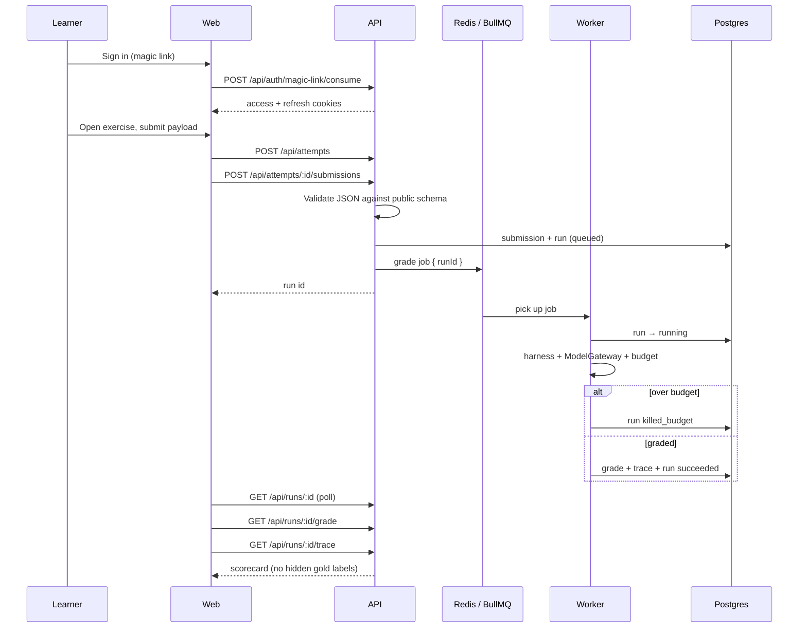

# LabPath

Practice platform for AI engineering. Sets, reps, and a score — not courses.

Learners solve bounded, graded problems (chunking, retrieval, eval design, injection defence). Hidden eval sets score the work. Feedback names the failure class, not just a pass/fail. Teaching, if wanted later, is a human tutor — not a curriculum.

> The gym for AI engineers. Coaches available at the desk.

**This repo is the Phase 0 inner POC:** ten playable exercises across three simulators, a catalogue, a workspace, traces, and progress. It is not a public launch. Stripe, a code sandbox, contests, and a visual redesign are out of this phase.

Product spec: [docs/Labpath specification/LabPath-Specification.md](./docs/Labpath%20specification/LabPath-Specification.md) · Phase plan: [docs/phase.md](./docs/phase.md) · Inner POC steps: [docs/phase-0.md](./docs/phase-0.md)

---

## Status

Phase 0 build is through **Step 12**. **Step 13** (inner POC sign-off) is the remaining gate before Phase 0 is closed.

| Area | State |
|---|---|
| Infra | Postgres (pgvector) `:5434`, Redis `:6382` |
| Auth | Magic-link → JWT access + rotating refresh cookies |
| Catalogue | 10 published exercises, hidden sets never in API JSON |
| Practice loop | Attempt → submit → BullMQ `grade` job → run → scorecard |
| Harnesses | RAG (R1–R4), Eval (E1–E3), Guardrails (G1–G3) |
| Gateway | Single `ModelGateway`; pinned models; EUR micros; `killed_budget` |
| Web | Catalogue, workspace, run, trace, progress |

Verdicts are `pass | fail | inconclusive`. Money is EUR micros. Learner input is JSON config, prompts, Assertion DSL, or Slice Spec — not arbitrary code.

---

## Architecture

Three processes, two data stores, exercise content on disk. HTTP never grades inline.



| Process | Entry | Owns |
|---|---|---|
| Web | `apps/web` · `npm run dev:web` | Catalogue, workspace, scorecard, traces, progress. Calls the API with `credentials: include`. |
| API | `apps/api/src/main.ts` · `npm run dev:api` | Auth, catalogue, attempts, submissions, run polling, grades, traces, hints, progress, ingest, cost readout. Enqueues jobs. Does **not** run harnesses. |
| Worker | `apps/api/src/worker.ts` · `npm run dev:worker` | `GradingPipeline`, three harnesses, `ModelGateway`, budget kill, `gen_cache` / `judge_cache`. Writes `grades` + trace blobs. |

Health is split: `GET /api/health` is liveness (process up). `GET /api/health/ready` is readiness (Postgres + Redis).

### Why API and worker are separate

Grading can take seconds, call models, and burn budget. Spec requires a worker process so a submit request returns a run id immediately. The API process does not import harness code. The worker process does not serve HTTP.

```
AppModule (HTTP)          WorkerModule
  identity, catalogue       grading (harnesses, gateway,
  practice, progress          pipeline, processors)
  ingest, cost, health
  prisma, redis, queue      prisma, redis, queue
```

---

## System design

### Product constraints that shape the code

| # | Rule | In this codebase |
|---|---|---|
| P1 | Objective pass/fail | Class A metric + threshold on every exercise |
| P2 | Deterministic checks before LLM judgement | Class B judges are advisory / stubbed in Phase 0 |
| P3 | Feedback is the product | Scorecard, failure classes, rotating failing samples |
| P4 | Hidden test sets | `harness` schema + files under `content/`; never selected by the API role |
| P6 | Bounded cost and time | Per-exercise budget; gateway meters tokens and EUR micros |
| P7 | No lessons | Progressive hints only |

### Request path: submit → scorecard



Invalid payloads are `400` before a job exists. The same payload re-grades to the same class A verdict (frozen retrieval / frozen generation fixtures; caches on the gateway).

### Data model

Postgres has two schemas so hidden assets cannot leak through a careless SELECT.

```
public                          harness
------                          -------
users, identities,              exercise_assets  (hidden eval URIs)
  magic_links, refresh_tokens   corpus_chunks    (pgvector)
skills, exercises               gen_cache
attempts, hint_unlocks          judge_cache
submissions, runs               label_sets
grades, traces
user_skill_scores
```

Core loop:

```
User 1──* Attempt 1──* Submission 1──* Run 1──1 Grade
                                              └─1 Trace (blob URI, not inline gold)
Exercise (public brief, schema, budgets, gates)
ExerciseAsset (paths into content/, worker-only)
```

- **Attempt** — one learner × one published exercise.
- **Submission** — JSON payload + hash (re-grade / cache key later).
- **Run** — one worker execution: `queued → running → succeeded | failed | killed_budget`. Tokens, cost (EUR micros), cache-hit ratio live here.
- **Grade** — `verdict`, metrics, gate results, failure classes, scorecard, failing cases.
- **Trace** — instrumentation for the learner (retrieved chunks, scores, tokens). Gold labels and canary phrases must not appear.

Exercise content is versioned on disk and seeded into `exercises` + `harness.exercise_assets`:

```
apps/api/content/exercises/<slug>/
  meta.json           public metadata, schema, gates, budget
  eval_public.json    sample the learner may see
  eval_hidden.json    scoring set — never in API responses
  hints.json
  corpus.json         RAG only
```

Ingest (`POST /api/internal/ingest/exercises`, HMAC) upserts that content. The HTTP mapper for `GET /api/exercises/:slug` strips hidden fields.

### Grading engine

`GradingPipeline` loads the run, reads worker-only assets, dispatches by `exercise.simulator`, then writes grade + trace in one transaction and updates skill scores.

```
GradeProcessor
  └─ GradingPipeline
       ├─ RagHarness        R1 chunking · R2 cost · R3 citation · R4 rerank
       ├─ EvaluationHarness E1 Assertion DSL · E2 learner-judge · E3 Slice Spec
       └─ GuardrailsHarness G1 concierge · G2 indirect payload · G3 hold the line
            │
            ├─ ModelGateway   complete / judge / embed (only path to a model)
            ├─ BudgetEnforcer kill run → killed_budget
            ├─ Assertion DSL  RE2-lite (E1, G3 filters)
            ├─ Slice Spec     separate grammar (E3 only — not merged into the DSL)
            └─ CanaryNormaliser encodings for injection defence
```

**Class A** gates are deterministic (recall@5, cost ceiling, F1, Wilson interval, …). **Class B** (LLM-as-judge) is stubbed/advisory in this POC; it is not a pass/fail gate.

Harnesses must not import a provider SDK. All generation, embeddings, and judges go through `ModelGateway`, which:

1. Pins model versions (`pricing.ts`).
2. Keys `gen_cache` on `(modelVersion, promptHash, paramsHash)` and `judge_cache` on `(judgeVersion, rubricHash, outputHash)`.
3. Counts tokens and EUR micros onto the run.
4. Asks `BudgetEnforcer` before spend; over-budget throws `BudgetExceededError` and the processor leaves the run as `killed_budget`.

Phase 0 uses a **fake pinned gateway** (no live provider keys in git). The cutoff path is real: `POST /api/internal/cost/over-budget` proves a kill.

### Auth and tenancy

Inner POC auth is magic link only (OAuth stubs exist, unimplemented).

1. `POST /api/auth/magic-link` — in development, token is returned/logged; no email vendor.
2. `POST /api/auth/magic-link/consume` — sets HTTP-only access + refresh cookies.
3. `GET /api/me` — current user.
4. `POST /api/auth/refresh` / `logout` — rotating refresh.

`JwtAuthGuard` is global. Health endpoints are `@Public()`. Roles (`learner | tutor | org_admin | admin`) exist on `User` so later phases do not rewrite identity; tutor marketplace tables do not.

### Isolation rules

- Hidden canaries (`HIDDEN_EVAL_*`) are grepped out of grade and trace JSON; `GradesService` refuses to return a payload that contains them.
- Worker asset reads are restricted to `content/exercises` and `content/corpora`.
- CORS is origin-allowlist + credentials so cookies stay on `localhost` during local dev.
- G1 live chat (`POST /api/simulations/g1/turns`) is a mock concierge for the workspace, not a second grading path.

---

## Repository layout

npm workspaces. Node ≥ 20.

```
apps/api/                 NestJS HTTP API + worker (same package, two entrypoints)
  src/main.ts             HTTP process
  src/worker.ts           worker process
  src/core/               config, prisma, redis, BullMQ, logger, health
  src/common/             guards, pipes, cookies, validation
  src/modules/
    identity/             magic link, JWT, /me
    catalogue/            exercises, skills
    practice/             attempts, submissions, runs, grades, traces, hints, simulations
    progress/
    ingest/               signed exercise upsert
    cost/                 internal cost readout + budget probe
    grading/              worker-only: harnesses, gateway, DSL, metrics, pipeline
  content/exercises/      authored exercises (public + hidden)
  prisma/                 schema, migrations, seed
apps/web/                 Next.js App Router (Phase 0 screens)
  src/app/(auth)          login, magic-link
  src/app/(app)           catalogue, workspace, run, trace, progress
  src/features/           auth, catalogue, workspace, traces, progress
infra/                    Postgres init (pgvector)
docs/                     product spec + phase plans
```

---

## The ten exercises

Every exercise has a class A gate, a reference that passes, and a near-miss that fails.

| ID | Title | Simulator | Band | What you submit |
|---|---|---|---|---|
| R1 | Chunk It Right | RAG | E | Chunk size / overlap / split strategy |
| R2 | The Cost Ceiling | RAG | E/M | `topK`, rerank, chunk size |
| R3 | The Citation Contract | RAG | M | Grounded generation prompt (flagship) |
| R4 | Rerank or Re-think | RAG | M/H | Reranker + rewrite |
| E1 | Write the Assertion Suite | Eval | E | Assertion DSL YAML |
| E2 | Judge the Judge | Eval | M | Rubric + judge prompt |
| E3 | Catch the Regression | Eval | M/H | Slice Spec YAML (5 attempts / 24h) |
| G1 | Break the Concierge | Guardrails | E | Attack prompt (live mock chat) |
| G2 | The Indirect Payload | Guardrails | M | Untrusted page content |
| G3 | Hold the Line | Guardrails | M/H | System prompt + input/output filters |

Workspaces: `/exercises/<slug>` for each of the slugs in `apps/api/content/exercises/`.

---

## Local development

Host ports **5432** and **6379** were already taken on the team machines, so Compose publishes Postgres on **5434** and Redis on **6382**.

```bash
cp apps/api/.env.example apps/api/.env
cp apps/web/.env.example apps/web/.env.local
docker compose up -d
npm install
npm run prisma:generate
npm run prisma:migrate:deploy
npm run prisma:seed
npm run dev:api      # http://localhost:3001
npm run dev:worker
npm run dev:web      # http://localhost:3000
```

| Service | URL |
|---|---|
| Web | http://localhost:3000 |
| API | http://localhost:3001/api |
| Liveness | http://localhost:3001/api/health |
| Readiness | http://localhost:3001/api/health/ready |
| Cost readout | `GET /api/internal/cost` (authenticated) |
| Budget probe | `POST /api/internal/cost/over-budget` |

Seed a user via magic link, open the catalogue, submit R1 (or any of the ten), poll the run, open the scorecard and trace.

```bash
npm test             # API unit tests (harness + DSL + budget)
npm run lint
npm run typecheck
```

API e2e: `npm run test:e2e -w @labpath/api`.

---

## HTTP API

Prefix: `/api`. Authenticated unless marked public.

| Method | Path | Notes |
|---|---|---|
| GET | `/health` | Liveness (public) |
| GET | `/health/ready` | Postgres + Redis (public); 503 if down |
| POST | `/auth/magic-link` | Request token (public) |
| POST | `/auth/magic-link/consume` | Set cookies (public) |
| POST | `/auth/refresh` | Rotate refresh |
| POST | `/auth/logout` | |
| GET | `/me` | Current user |
| GET | `/me/progress` | Attempts, solves, skill scores |
| GET | `/exercises` | Published catalogue |
| GET | `/exercises/:slug` | Brief, public schema, budgets — **no hidden set** |
| GET | `/exercises/:slug/hints` | Unlocked hints |
| POST | `/exercises/:slug/hints/next` | Progressive unlock |
| GET | `/skills` | Skill tree |
| POST | `/attempts` | Start an attempt |
| POST | `/attempts/:id/submissions` | Validate + enqueue grade |
| GET | `/runs/:id` | Status, tokens, cost |
| GET | `/runs/:id/grade` | Scorecard when ready |
| GET | `/runs/:id/trace` | Instrumentation, no gold labels |
| GET | `/runs/:id/stream` | SSE stub |
| POST | `/simulations/g1/turns` | G1 mock concierge turn |
| POST | `/simulations/g2/page` | G2 page payload |
| GET | `/internal/cost` | Ugly internal cost dashboard |
| POST | `/internal/cost/over-budget` | Fake job that must be killed |
| POST | `/internal/ingest/exercises` | HMAC-signed upsert |

---

## What is not in this phase

Code sandbox, Stripe, contests, streaks, public profiles, tutors, courses, i18n, and the Prompt Engineering / Agent / Benchmark / Neural Network / Fine-tune simulators. Role enum and durable traces ship now so those phases are not a rewrite.

Full public bar (20 external testers, κ ≥ 0.70, 99% on 1,000 re-grades, blended €0.20) is **not** the inner POC sign-off. That list is in the spec §0.8 and [docs/phase.md](./docs/phase.md). Inner POC bar is Step 13 in [docs/phase-0.md](./docs/phase-0.md).
